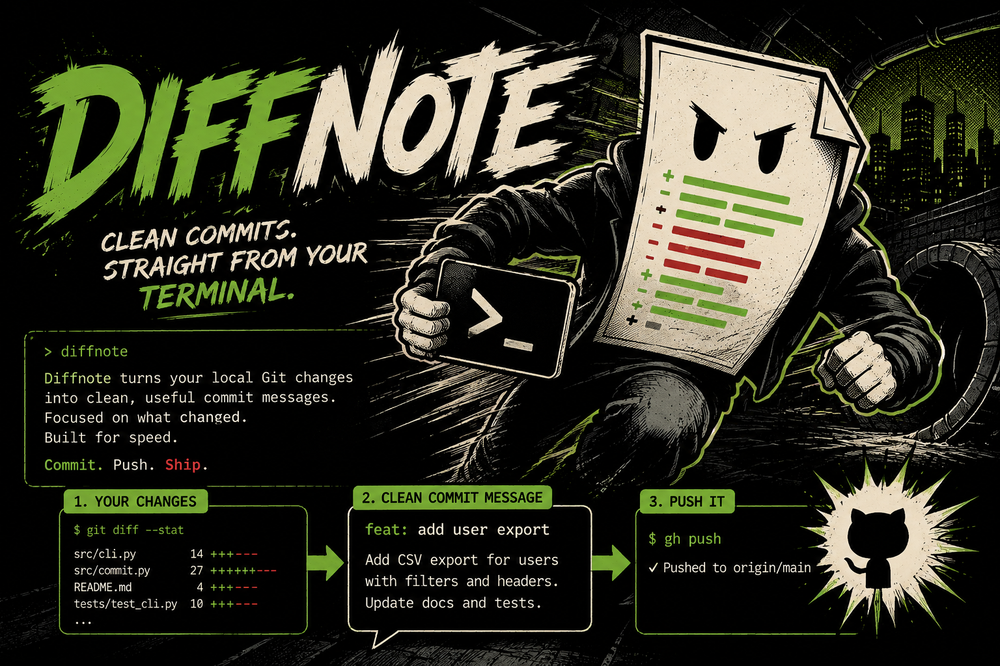

# diffnote

<p align="center">
  
</p>

<p align="center">
  <a href="https://www.npmjs.com/package/diffnote"></a>
  <a href="https://www.npmjs.com/package/diffnote"></a>
  <a href="./LICENSE"></a>
  
  <a href="https://github.com/bobbybacklogs/diffnote/releases"></a>
</p>

Diffnote is a command-line utility that automates Git commit message generation and repository publishing. It analyzes Git modifications strictly within the active working directory, generates structured Conventional Commit messages using ModelHitch, and can push commits directly to GitHub via the GitHub CLI.

---

## Key Capabilities

- **Directory-Scoped Reviews**: Restricts change detection and staging strictly to the current working directory, ensuring clean commits within monorepos and subdirectories.
- **ModelHitch Integration**: Connects to ModelHitch to draft concise commit titles (under 72 characters) and structured, bulleted change summaries following the Conventional Commits standard.
- **GitHub CLI Integration**: Interfaces with the authenticated GitHub CLI (`gh`) to push branches and retrieve commit URLs upon completion.
- **Flexible Workflow Modes**: Supports interactive confirmation, dry-run previews, automated staging and pushing, and raw output suitable for shell scripts.
- **Built-in Diagnostics**: Provides command-line status reporting for Git repository state, ModelHitch bridge connectivity, and GitHub credentials.

---

## Installation

### Instant Execution (Recommended)

Run Diffnote directly without installing:

```bash
npx diffnote
```

### Global Installation

Install globally using npm:

```bash
npm install -g diffnote
```

---

## Quick Start

1. Navigate to any repository or subdirectory containing modified files:

   ```bash
   cd path/to/your/project
   ```

2. Run `diffnote`:

   ```bash
   diffnote
   ```

3. Review the generated commit title and body. Choose to commit, edit, regenerate with custom guidance, or view the diff.

4. When prompted, confirm whether to push the commit to GitHub using the GitHub CLI.

---

## Command Reference

```text
USAGE
  diffnote [options]
  diffnote <command> [options]

COMMANDS
  review            Review scoped diff and generate commit message without committing
  commit            Generate commit message and commit staged or unstaged changes
  push              Generate commit message, commit, and push via GitHub CLI
  status            Display repository, ModelHitch bridge, and GitHub CLI status
  help              Display general help or argument documentation (diffnote help args)

OPTIONS
  -a, --all           Stage all directory changes prior to committing
  -s, --staged        Only inspect staged changes in current working directory
  -p, --push          Automatically push to GitHub via GitHub CLI after committing
  -d, --dry-run       Preview generated title and message without committing
  -r, --raw           Print only the commit title and body (ideal for scripts)
  -y, --yes           Confirm commit prompt automatically
  -m, --model <name>  Specify ModelHitch model (default: bridge active model)
  -b, --bridge <url>  Specify ModelHitch bridge URL (default: http://127.0.0.1:3939/v1)
  --cwd <path>        Set target working directory (default: .)
  --hint <text>       Provide additional context or instructions to the AI
  --arg-help          Display comprehensive argument documentation
  -h, --help          Display help overview
  -v, --version       Display version information
```

---

## Practical Examples

### Stage and Push in One Step

Stage all modified and untracked files in the active directory, generate the commit message, and push to GitHub:

```bash
diffnote --all --push
```

### Preview Generated Messages (Dry Run)

Generate and display the commit proposal without staging, committing, or pushing:

```bash
diffnote --dry-run
```

### Guide the Commit with a Context Hint

Supply relevant context or an issue identifier:

```bash
diffnote --hint "Closes issue #142 by updating bridge connection timeout"
```

### System and Service Verification

Inspect the current status of the Git repository, the ModelHitch bridge, and GitHub CLI authentication:

```bash
diffnote status
```

### Direct Scripting and Aliases

Use raw mode to feed the generated message directly into standard Git commands:

```bash
git commit -m "$(diffnote --raw)"
```

### In-Depth Argument Documentation

Access full details on every flag, type, default value, and configuration parameter:

```bash
diffnote --arg-help
```

---

## ModelHitch Bridge Configuration

By default, Diffnote communicates with the local ModelHitch bridge at `http://127.0.0.1:3939/v1`.

If the bridge is not running, start it using:

```bash
npx modelhitch bridge --background
```

To configure custom endpoints or defaults, set the following environment variables:

| Environment Variable | Description | Default Value |
| --- | --- | --- |
| `DIFFNOTE_BRIDGE_URL` | Primary URL for the ModelHitch bridge endpoint | `http://127.0.0.1:3939/v1` |
| `MODELHITCH_BRIDGE_URL` | Fallback URL for the ModelHitch bridge endpoint | `http://127.0.0.1:3939/v1` |
| `DIFFNOTE_MODEL` | Default model identifier for commit generation | `big-pickle` |

---

## License

This project is licensed under the MIT License. See the [LICENSE](./LICENSE) file for details.
